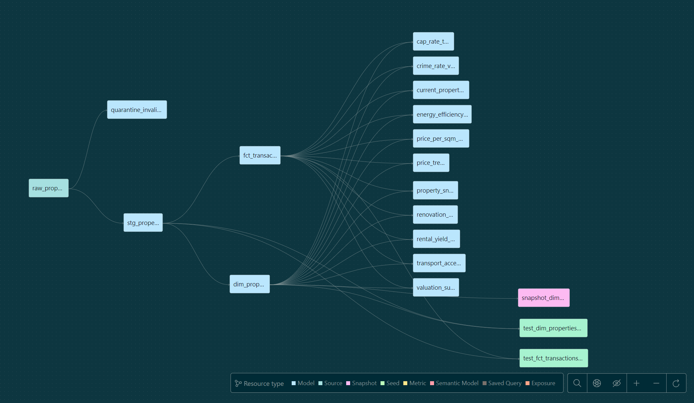

# Real Estate Valuation Data Pipeline with dbt Fusion and Snowflake

This project builds a data pipeline for real estate valuation using Snowflake, AWS S3, dbt Fusion 2.0.0-beta.13, GitHub Actions for CI/CD, and dbt Cloud for production deployment. Follow the steps below to set up the pipeline, matching the YouTube demo chapters.  

# Project Demonstration Videos

[](https://youtu.be/rlnksiYvh_g)

Click the image above to watch the full video for an in-depth overview of the data pipeline setup, including AWS S3 integration with Snowflake, dbt installation, Snowflake connection setup, and CI/CD automation with GitHub Actions. This video covers the entire process from data ingestion to deployment using dbt Cloud.

## Prerequisites
- Snowflake account with admin access
- AWS account with S3 bucket (`s3://real-estate-datalake/`)
- Python 3.9+ installed
- VS Code with the dbt extension
- GitHub repository access
- dbt Cloud account
- Windows PowerShell

## Table of Contents
- [Introduction](#introduction)
- [Project Structure](#project-structure)
- [Integrating AWS S3 with Snowflake](#integrating-aws-s3-with-snowflake)
- [DBT Fusion Installation and Snowflake Connection Setup](#dbt-fusion-installation-and-snowflake-connection-setup)
- [Setting Up and Working with DBT Extension with VS Code](#setting-up-and-working-with-dbt-extension-with-vs-code)
- [Creating and Using Macros & Quarantine Tables in dbtf](#creating-and-using-macros--quarantine-tables-in-dbtf)
- [DBT Data Validation: Unit Tests vs Data Tests](#dbt-data-validation-unit-tests-vs-data-tests)
- [Custom Schema Mapping for Model Organization](#custom-schema-mapping-for-model-organization)
- [Managing Slowly Changing Dimensions with dbt fusion Snapshots](#managing-slowly-changing-dimensions-with-dbt-fusion-snapshots)
- [Automating Testing and Deployment with dbt fusion CI/CD](#automating-testing-and-deployment-with-dbt-fusion-cicd)
- [Deploying to dbt Cloud: Connecting the Git Repository and Creating Jobs](#deploying-to-dbt-cloud-connecting-the-git-repository-and-creating-jobs)
- [Conclusion & Summary](#conclusion--summary)


### Introduction

This project implements an end-to-end real estate valuation data pipeline leveraging Snowflake as the data warehouse, AWS S3 as the data lake storage, and dbt Fusion (version 2.0.0-beta.13) for transformation and modeling. It features a modern data engineering workflow with automated CI/CD pipelines via GitHub Actions and production deployment through dbt Cloud.

The pipeline is designed to ingest raw JSON property data from an S3 bucket into Snowflake using external stages and COPY INTO commands. The raw data is then processed through modular dbt models organized by schema and function, including staging, core marts, quarantining invalid records, and analytical models.

Key components include:

- Integration between AWS S3 and Snowflake for efficient data loading.

- A robust dbt Fusion project setup with reusable macros, custom schema mappings, and snapshotting to track slowly changing dimensions.

- Comprehensive data validation with both unit tests and data tests to ensure data quality and model correctness.

- Use of quarantine tables to isolate and manage invalid data early in the pipeline.

- Automated CI/CD workflows configured with GitHub Actions to enforce testing and seamless deployment across development and production environments.

- Development and debugging facilitated through the dbt VS Code extension to visualize model lineage and preview query results.

This project follows best practices for scalable, maintainable data pipelines, enabling reliable and transparent real estate valuation analytics.


## Project Structure

```sql

REAL_ESTATE_VALUATION_FUSION/
├── .dbt/
├── .github/
│   └── workflows/
│       ├── rev-cd.yml
│       └── rev-ci.yml
├── .vscode/
├── dbt_internal_packages/
├── dbt_packages/
├── logs/
├── macros/
│   ├── tests/
│   │   ├── test_numeric_range.sql
│   ├── utils/
│   │   ├── dev_filter_by_year.sql
│   │   ├── flatten_property_transactions.sql
│   │   ├── generate_schema_name.sql
│   │   ├── run_custom_query.sql
│   │   ├── staging_filters.sql
│   │   ├── utility_macros.sql
│   │   └── valuation_macros.sql
│   └── .gitkeep
├── models/
│   ├── analysis/
│   │   ├── cap_rate_trends.sql
│   │   ├── crime_rate_vs_price.sql
│   │   ├── energy_efficiency_value_gain.sql
│   │   ├── price_per_sqm_distribution.sql
│   │   ├── price_trends.sql
│   │   ├── renovation_impact.sql
│   │   ├── rental_yield_by_type.sql
│   │   └── transport_access_impact.sql
│   ├── core/
│   │   ├── dim_properties.sql
│   │   └── fct_transactions.sql
│   ├── marts/
│   │   ├── current_property_valuation.sql
│   │   ├── property_snapshot.sql
│   │   └── valuation_summary.sql
│   ├── quarantine/
│   │   ├── quarantine_invalid_properties.sql
│   │   └── .gitkeep
│   ├── staging/
│   │   ├── !staging_sources.yml
│   │   ├── stg_properties.sql
│   │   └── .gitkeep
│   └── .gitkeep
├── seeds/
├── snapshots/
│   └── dim_property/
│       ├── snapshot_dim_property.sql
│       └── .gitkeep
├── target/
├── tests/
│   ├── data_test/
│   │   ├── construction_year_valid.sql
│   │   ├── duplicate_properties.sql
│   │   ├── price_per_sqm_positive.sql
│   │   ├── !price_per_sqm_positive.sql
│   │   ├── property_schema_tests.yml
│   │   ├── sale_price_non_negative.sql
│   │   └── transactions_without_properties.sql
│   ├── unit_test/
│   │   ├── core/
│   │   │   ├── !test_dim_properties.yml
│   │   │   └── !test_fct_transactions.yml
│   │   ├── staging/
│   │   └── .gitkeep
│   └── .gitkeep
├── venv/
├── .gitignore
├── dbt_project.yml
├── dev_data_part_1.json
├── package-lock.yml
├── packages.yml
└── raw_data_api.py
```


## Step-by-Step Guide

### Integrating AWS S3 with Snowflake
I show how to create a Snowflake external stage connected to an AWS S3 bucket and how to use it to load data into Snowflake using the `COPY INTO` command.


- **Create Production Database and Schemas**
  In Snowflake, create the production database and schemas:

```sql

  CREATE DATABASE IF NOT EXISTS REAL_ESTATE_VAL_PROD;
  USE DATABASE REAL_ESTATE_VAL_PROD;
  CREATE SCHEMA IF NOT EXISTS staging;
  CREATE SCHEMA IF NOT EXISTS core;
  CREATE SCHEMA IF NOT EXISTS analysis;
  CREATE SCHEMA IF NOT EXISTS quarantine;
  CREATE SCHEMA IF NOT EXISTS SNAPSHOTS;

```


- **Create Storage Integration**
  Create an S3 integration in Snowflake:

```sql

  CREATE OR REPLACE STORAGE INTEGRATION s3_int
    TYPE = EXTERNAL_STAGE
    STORAGE_PROVIDER = S3
    ENABLED = TRUE
    STORAGE_AWS_ROLE_ARN = 'arn:aws:iam::YOUR_ACCOUNT:role/YOUR_ROLE'
    STORAGE_ALLOWED_LOCATIONS = ('s3://real-estate-datalake/');
```

- **Describe Integration**
  Get the external ID to update the AWS trust policy:

```sql

  DESC STORAGE INTEGRATION s3_int;
```

  Update the IAM role’s trust policy in AWS with the external ID.

- **Create JSON File Format**
  Define a JSON file format:

 ```sql

  CREATE OR REPLACE FILE FORMAT json_format
    TYPE = 'JSON'
    STRIP_OUTER_ARRAY = TRUE;

```


- **Create Stage for Production Data**
  Create a stage in the staging schema:

```sql

  USE SCHEMA REAL_ESTATE_VAL_PROD.staging;
  CREATE OR REPLACE STAGE s3_stage
    STORAGE_INTEGRATION = s3_int
    URL = 's3://real-estate-datalake/prod/raw/properties/'
    FILE_FORMAT = json_format;
```


- **Create Landing Table**
  Create a table to hold raw data:

```sql

  CREATE OR REPLACE TABLE staging.raw_properties (
    raw_data VARIANT
  );
```


- **Load Data into Landing Table**
  Copy data from S3:

```sql

  COPY INTO staging.raw_properties
  FROM @s3_stage/year=2025/
  PATTERN = '.*data_part_.*[.]json'
  FILE_FORMAT = json_format
  ON_ERROR = 'CONTINUE';

```

- **Verify Data Load**
  Check the loaded data:

```sql

  SELECT COUNT(*) FROM staging.raw_properties;
  SELECT * FROM staging.raw_properties LIMIT 10;

```

- **Create Development Database**
  Clone the production database for dev:

```sql

  CREATE OR REPLACE DATABASE REAL_ESTATE_VAL_DEV CLONE REAL_ESTATE_VAL_PROD;

```

  This uses zero-copy cloning, saving storage costs. In dev, use a subset of data for testing.

### DBT Fusion Installation and Snowflake Connection Setup
This covers how to set up a dbt Fusion project, configure the Snowflake profile, and verify the connection by running a test model.


- **Create Virtual Environment**
  In Windows PowerShell, create and activate a virtual environment:

```sql

  python -m venv venv
  .\venv\Scripts\Activate.ps1
```


- **Install dbt Fusion**
  Install dbt Fusion, which includes warehouse adapters:

```sql

  curl -fsSL https://public.cdn.getdbt.com/fs/install/install.sh | sh -s -- --update
```

  Reload PowerShell to recognize the new path:

```sql

  Start-Process powershell
```

  Verify installation:

```sql

  dbtf --version
```

- **Get Snowflake Credentials**
  In Snowflake, go to Account > Users > [Your User] to find your username. Reset your password if needed. Find your account identifier in Account > Overview (e.g., `abc12345.us-east-1`). Use a role with access to `REAL_ESTATE_VAL_PROD` and `REAL_ESTATE_VAL_DEV`, and a warehouse (e.g., `COMPUTE_WH`).

- **Initialize dbt Fusion Project**
  Initialize the project and provide Snowflake credentials:

```sql

  dbtf init --project-name real_estate_valuation_fusion
```

  Follow prompts:
  - Select Snowflake as the warehouse.
  - Enter account: `YOUR_SNOWFLAKE_ACCOUNT`
  - Enter user: `YOUR_SNOWFLAKE_USER`
  - Enter password: `YOUR_SNOWFLAKE_PASSWORD`
  - Enter role: `YOUR_SNOWFLAKE_ROLE`
  - Enter database: `REAL_ESTATE_VAL_DEV`
  - Enter warehouse: `COMPUTE_WH`
  - Enter schema: `STAGING`
  - Enter threads: `4`
  This creates `~/.dbt/profiles.yml` and project structure with folders: `models`, `macros`, `seeds`, `tests`, `snapshots`.

- **Update profiles.yml for Prod**
  Edit `~/.dbt/profiles.yml` to add prod configuration:

```sql

  real_estate_valuation_fusion:
    outputs:
      dev:
        type: snowflake
        account: YOUR_SNOWFLAKE_ACCOUNT
        user: YOUR_SNOWFLAKE_USER
        password: YOUR_SNOWFLAKE_PASSWORD
        role: YOUR_SNOWFLAKE_ROLE
        database: REAL_ESTATE_VAL_DEV
        warehouse: COMPUTE_WH
        schema: STAGING
        threads: 4
      prod:
        type: snowflake
        account: YOUR_SNOWFLAKE_ACCOUNT
        user: YOUR_SNOWFLAKE_USER
        password: YOUR_SNOWFLAKE_PASSWORD
        role: YOUR_SNOWFLAKE_ROLE
        database: REAL_ESTATE_VAL_PROD
        warehouse: COMPUTE_WH
        schema: STAGING
        threads: 4
    target: dev
```

  Navigate to the project:

```sql

  cd real_estate_valuation_fusion
```

### Setting Up and Working with DBT Extension with VS Code  
Use the dbt VS Code extension for development.

- **Set Up dbt Extension Requirements**
  The dbt extension requires a `dbt_project.yml` in the workspace root. If using a monorepo, create a `.code-workspace` file:
  - In VS Code, run `File > Add Folder to Workspace` and select `real_estate_valuation_fusion`.
  - Save the workspace as `real_estate.code-workspace`.
  Download the CLI configuration file from dbt Cloud:
  - In dbt Cloud, go to Profile > CLI > Download CLI configuration file.
  - Place it at `~/.dbt/dbt_cloud.yml`.

- **Install the dbt Extension**
  Open VS Code, go to Extensions, and install the dbt extension.

- **Open the Project**
  Open the `real_estate_valuation_fusion` folder in VS Code.

- **Use Lineage and Query Results**
  Use the extension to view the lineage graph (shows dependencies like `raw_properties` > `stg_properties` > `int_property_values` > `dim_properties` > `snapshot_dim_property`) and preview query results for debugging.

### Creating and Using Macros & Quarantine Tables in dbtf
Organize the project with macros and quarantine tables.

- **Creating and Using Macros**
  Macros live in the `macros` folder with subfolders `test` and `utils`. The `flatten_property_transactions()` macro is used in both `quarantine_invalid_properties.sql` and `stg_properties.sql` to standardize property data extraction from JSON. Macros enhance reusability, reducing code duplication and ensuring consistent logic across models.

- **Creating and Using Quarantine Tables**
  The `quarantine` folder contains `quarantine_invalid_properties.sql`, which isolates invalid data (e.g., negative prices) as seen in the lineage graph. Invalid data stops at this table, preventing errors in downstream models like `int_property_values` or `dim_properties`. This improves data quality and debugging efficiency.

- **Install Packages**
  Create `packages.yml`:

```

  packages:
    - package: dbt-labs/dbt_utils
      version: 1.1.1
```

  Install dependencies:

```

  dbtf deps
```


### DBT Data Validation: Unit Tests vs Data Tests
Add tests to validate data and logic.

- **Importance of Data Tests**
  Data tests, in the `data_test` folder, validate real data against business rules (e.g., ensuring prices are positive). They catch issues in production data, maintaining data integrity.

- **Importance of Unit Tests**
  Unit tests, in the `unit_test` folder, verify transformation logic (e.g., sale year calculation) with mocked data. They ensure model accuracy before deployment.

### Custom Schema Mapping for Model Organization
Configure schema mappings for models.

- **Schema Generation Macro**
  The `generate_schema_name` macro in `macros/utils/generate_schema_name.sql` dynamically assigns schemas based on model paths. It uses `target.schema` as default, overrides with custom names if provided, or maps:
  - `analysis` to `ANALYSIS`
  - `core` or `marts` to `CORE`
  - `staging` or `base` to `STAGING`
  - `quarantine` to `QUARANTINE`
  This organizes data into logical Snowflake schemas.

### Managing Slowly Changing Dimensions with dbt fusion Snapshots
Create a snapshot to track changes.

- **Create Snapshot**
  Create `snapshots/dim_property/snapshot_dim_property.sql`:

```

  
  {{
      config(
          target_schema='SNAPSHOTS',
          unique_key='property_id',
          strategy='check',
          check_cols=[
              'renovation_year',
              'condition',
              'has_balcony',
              'has_elevator',
              'has_parking',
              'heating_type',
              'energy_rating',
              'energy_consumption_kwh_m2',
              'cap_rate',
              'median_income',
              'pop_density',
              'crime_rate'
          ]
      )
  }}
  SELECT * FROM {{ ref('dim_properties') }}
  
```


- **Run Snapshot**
  Run the snapshot:

```

  dbtf snapshot --target dev
```

- **Importance of Snapshots**
  Snapshots track slowly changing dimensions (e.g., property attributes) over time. The `strategy='check'` configuration compares specified `check_cols` (like `renovation_year`) between runs. If changes occur, a new record is created. dbt adds columns:
  - `dbt_valid_from`: Start timestamp of the record’s validity.
  - `dbt_valid_to`: End timestamp (NULL for current records).
  - `dbt_scd_id`: Unique identifier for each snapshot record.
  These columns enable historical analysis of property data changes.

### Automating Testing and Deployment with dbt fusion CI/CD
Set up CI/CD with GitHub Actions.

- **Test Locally**
  Test locally:

```sql

  dbtf debug
  dbtf run --target dev
  dbtf test --select tag:data_tests --target dev
  dbtf test --select tag:unit_tests --target dev
  dbtf snapshot --target dev
```

- **Set Up GitHub Repository**
  Initialize Git and push:

```python
  git init
  git add .
  git commit -m "Initial dbt project setup"
  git remote add origin https://github.com/ChuquEmeka/real_estate_valuation_dbt_fusion_snowflake_aws_pipeline.git
  git push -u origin main
  git checkout -b dev
  git push origin dev
```

- **CI/CD Workflows and Importance**
  The CI workflow (`rev-ci.yml`) triggers on pull requests to `main`, running debug, compile, and building models, snapshots, and all tests in dev. This ensures changes are validated before merging. The CD workflow (`rev-cd.yml`) triggers on pushes to `main`, deploying to prod by building models, snapshots, and data tests (excluding unit tests). This automates deployment, reducing manual errors and ensuring consistency between environments.

- **Add Secrets**
  Go to GitHub repository Settings > Secrets and variables > Actions. Add secrets:
  - `SNOWFLAKE_ACCOUNT`
  - `SNOWFLAKE_USER`
  - `SNOWFLAKE_PASSWORD`
  - `SNOWFLAKE_ROLE`
  - `SNOWFLAKE_WAREHOUSE`

- **Protect Main Branch**
  In GitHub, go to Settings > Branches > Add branch ruleset:
  - Name: Protect Main Branch
  - Target: main
  - Rules: Require pull request, require status checks (`CI for dbtf Models`), require conversation resolution
  - Enforcement: Enabled
  Save the ruleset.

- **Demonstrate CI/CD**
  Create a new model `models/analysis/fct_sales.sql`:

```sql
  SELECT
    property_id,
    price,
    sale_date
  FROM {{ ref('int_property_values') }}
  WHERE sale_date >= '2025-01-01'
```

  Push to dev:

```sql
  git add .
  git commit -m "Add fct_sales model"
  git push origin dev

```

  Create a feature branch and pull request:

```sql
  git checkout -b feature/fct-sales
  git push origin feature/fct-sales

```

  Create a pull request on GitHub, merge it after CI passes, and check prod deployment.

### Deploying to dbt Cloud: Connecting the Git Repository and Creating Jobs
Deploy the project to dbt Cloud.

- **Connect to dbt Cloud**
  Log into dbt Cloud and create a new project.
  Connect to your GitHub repository: `ChuquEmeka/real_estate_valuation_dbt_fusion_snowflake_aws_pipeline`.

- **Set Up Snowflake Connection**
  In dbt Cloud, configure a Snowflake connection for prod:
  - Type: Snowflake
  - Account: YOUR_SNOWFLAKE_ACCOUNT
  - User: YOUR_SNOWFLAKE_USER
  - Password: YOUR_SNOWFLAKE_PASSWORD
  - Role: YOUR_SNOWFLAKE_ROLE
  - Database: REAL_ESTATE_VAL_PROD
  - Warehouse: COMPUTE_WH
  - Schema: STAGING
  - Threads: 4

- **Create a Job**
  Create a job named "Prod Daily Run":
  - Schedule: Daily at 3 AM UTC
  - Commands: `dbtf build --exclude path:tests/unit_test --target prod`

- **Run the Job**
  Trigger the job manually in dbt Cloud and check the run logs.

### Conclusion & Summary
A data pipeline with Snowflake, dbt Fusion, CI/CD, and dbt Cloud deployment. Watch the YouTube demo for a visual guide.

## Project Lineage
The lineage graph shows: 


## YouTube Demo
[Watch the demo](YOUR_YOUTUBE_LINK) for a detailed walkthrough.